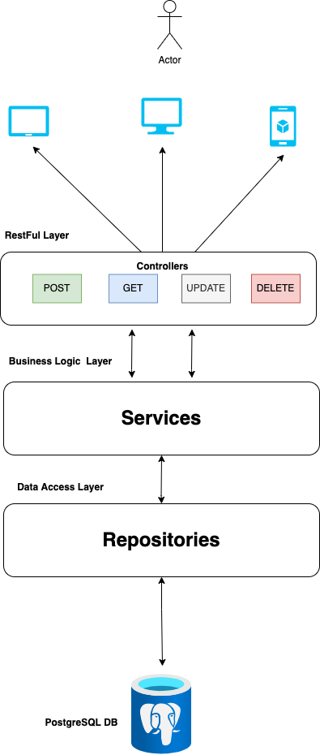

<h2 align="center">
  SpringBoot Student API Project 
</h2>

`JPA`, `Java SpringBoot`, `Postgresql`

## Motivation

In my previous experience, I worked with relational databases using JDBC, which is a Java API for interacting with databases. However, in this project, I made the decision to use Hibernate, which is an implementation of the Java Persistence API (JPA).

Hibernate simplifies the mapping of object data to the database schema using annotations. Unlike JDBC, which requires manual mapping code, Hibernate automatically handles the mapping based on the provided annotations. This approach reduces boilerplate code and enables a more object-oriented database interaction. Hibernate also offers advanced features, including caching, lazy loading, and transaction management, enhancing performance and reliability in Java applications.

## Project Overview

The Spring Boot project is an API that handles CRUD (Create, Read, Update, Delete) requests for managing students. The project is structured into different layers, including the API layer, service layer, and data access layer. It utilizes various technologies such as Hibernate, JPA (Java Persistence API), and PostgreSQL as the underlying database.

### Key Components and Features:

1. **API Layer**: The API layer handles incoming HTTP requests and maps them to corresponding methods in the controller classes. It defines endpoints for creating, reading, updating, and deleting student records.

2. **Service Layer**: The service layer contains the business logic of the application. It encapsulates the operations and rules related to managing students. The services communicate with the data access layer to perform CRUD operations.

3. **Data Access Layer**: The data access layer is responsible for interacting with the database. It utilizes Hibernate as the ORM (Object-Relational Mapping) framework and JPA for database persistence. The layer includes JPA repositories, which provide an interface to perform database operations.

4. **Hibernate and JPA**: Hibernate is used as the ORM framework to map Java objects to database tables. It simplifies database operations and provides features such as automatic schema generation, caching, and lazy loading. JPA, which is a specification for ORM in Java, is used in conjunction with Hibernate to define entities, relationships, and perform CRUD operations.

5. **PostgreSQL Database**: The project connects to a PostgreSQL database, which serves as the persistent data storage. PostgreSQL is a popular open-source relational database management system known for its reliability and compatibility with Java applications.

- Build API that will receive CRUD requested
- Service Layer
- Data Acccess Layer (connecting to any database)

## Learned

1. Spring Data JPA - abstraction on top of JPA & Hibernate -> easy to work with db.
2. Class = db
3. Hibernate -> Object -> ORM
4. JPA -> Generated queries (SQL)
5. API for CRUD operations on student records.
6. Implemented layers including API, service, and data access.
7. Utilized Hibernate and JPA for object-relational mapping.
8. Connected to a PostgreSQL database for data storage.
9. Learned to build an API, use Hibernate for mapping, and connect to databases.
10. How to package up your application and then from a jar spin up an instance that contains your application.
11. You can basically take the jar, deploy it to a server or dockerize it, do anything you want with your jar.

## Run Locally

> java -jar demo-0.0.1-SNAPSHOT.jar --server.port=8081

- Specify your own server

## Author

- [@ayazhankadessova](https://github.com/ayazhankadessova)
- [Linkedin](https://www.linkedin.com/in/ayazhankad/)

## 👩‍💻 About Me

I'm an aspiring Software Developer/Site Reliability Engineer from Kazakhstan, studying in Hong Kong.

## ✍️ Project Steps & Notes

- Saved My Steps & Notes [here](https://github.com/ayazhankadessova/springboot-java/blob/main/Notes.md).
